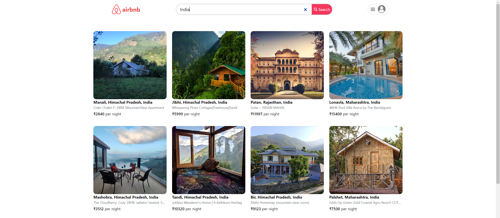
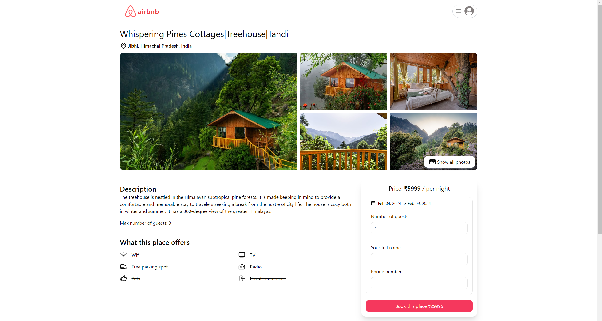

# Property Rental Web Application - Airbnb Clone

## Overview

This project is a full-stack web application developed as a clone of Airbnb using the MERN stack (MongoDB, Express.js, React.js, Node.js). It aims to replicate the core functionality of Airbnb, allowing users to search for accommodations, view details, make bookings, and manage their listings.

## Features

- **User Authentication:** Users can sign up, log in, and log out securely. Passwords are hashed for security.
- **Google Login:** Users can sign up and log in using their gmail.

  

- **Search Listings:** Users can search for accommodations.

  

- **View Listings:** Users can view detailed information about each accommodation, including photos, descriptions, amenities.

  

- **Make Bookings:** Authenticated users can book accommodations for specific dates.

  

- **Manage Listings:** Hosts can create, edit, and delete their listings.

  

- **Responsive Design:** The application is designed to be responsive and work seamlessly across different devices.

  

## Technologies Used

- **MongoDB:** NoSQL database for storing user data, listings.
- **Express.js:** Web application framework for building the backend server.
- **React.js:** JavaScript library for building the user interface.
- **Node.js:** JavaScript runtime environment for executing server-side code.
- **Tailwind CSS:** A utility-first CSS framework
- **Shadcn:** UI library for styling based on Tailwind CSS
- **JWT:** JSON Web Tokens for secure user authentication.
- **Cloudinary:** Cloud-based image management for storing and serving images.
- **Google Cloud:** For gmail based authentication
